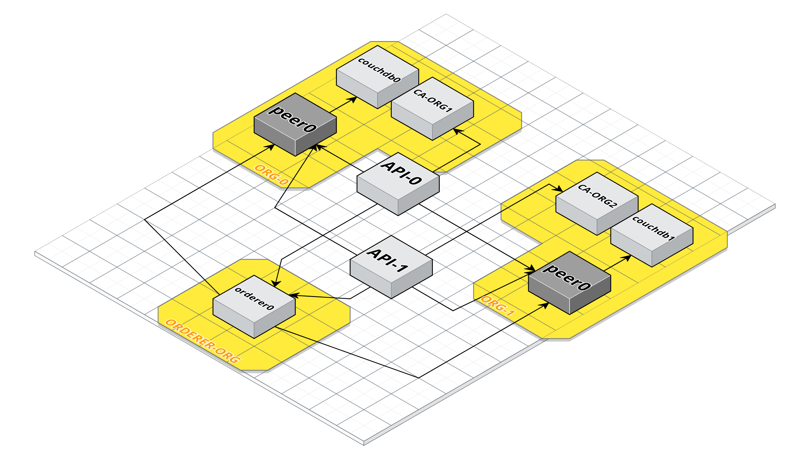
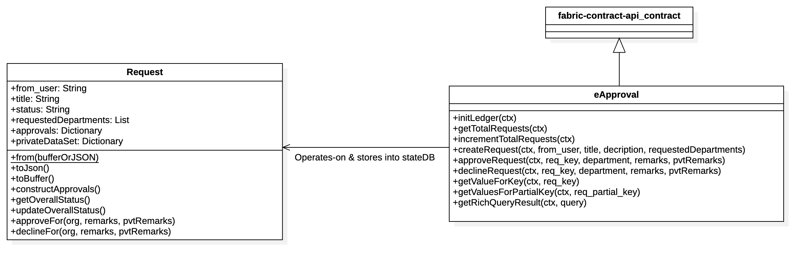

# eApproval
B.Tech Project On eApproval using Blockchain - Hyperledger Fabric.

 1. [System UseCase Diagram](#system-usecase-diagram)
 2. [Architecture](#architecture)
	- [4-Tier App Architecture](#4-tier-app-architecture)
	- [Fabric Network](#fabric-network)
	- [Chaincode](#chaincode)
	- [API](#api)
	- [UI](#ui)
 3. [System Security](#system-security)
 4. [Installation](#installation)

# System UseCase Diagram
- The System supports basic functionalities,
	- ADD new Request in StateDB.
	- RETRIEVE Requests stored in StateDB.
	- APPROVE | DECLINE Request stored in StateDB.
<p align="center">
	
</p>

# Architecture

1. ## 4-Tier App Architecture
	- The System has 4 Layers
		- UI
		- API
		- Chaincode
		- Data
<p align="center">
	
</p>

2. ## Fabric Network
	- The Network has 2 ORGs Each with,
		- 1 Peer
		- 1 CA-Peer
	- An Orderer ORG with 1 Peer
	- 2 API Containers
	<p align="center">
		
	</p>

	- PORT Mapping
		| Container | Port |
		|--|--|
		| peer0.org1.eapproval.com  | 7051  |
		| peer0.org2.eapproval.com  | 9051  |
		| couchdb0 | 5984 |
		| couchdb1 | 7984 |
		| ca_peerOrg1 | 7054 |
		| ca_peerOrg2 | 9054 |
		| orderer.eapproval.com | 7050 |
		| API1 | 8000 |
		| API2 | 8001 |
		| explorer.eapproval.com | 8080 |
		

3. ## Chaincode
	- The Chaincode has the following duties,
		- Create a Request & Store into StateDB.
		- Retrieve Request by querying the StateDB.
		- Approve | Decline a Request Stored in the StateDB.
<p align="center">
	
</p>

4. ## API
	- APIs communicates securely with the chaincode with fabric-node-sdk & also stores the user certificates locally.
	- Both APIs have Endpoints,
		- api/pendingRequests
		- api/approvedRequests
		- api/declinedRequests
		- api/createRequest
		- api/approve
		- api/decline
		- api/query
		- api/invoke
		- api/runRichQuery
		- api/login
		- api/register
	- Both APIs, Returns ORG specific private data.

5. ## UI
	- UI triggers the API Endpoints and actuates upon the StateDB via Chaincode.
	- UI has 4 sections,
		- Create Request
		- ORG1 Dashboard
		- ORG2 Dashboard
		- Public Board

# System Security
- The Security is promised via usage of Blockchain.
- Both the DB instances in this case is always in a synchronous state.
- But, if we try to make the states of both the DBs asynchronous by manual changes directly into DB, then while endorsing the Txns via Fabric-SDK on both the peers which involves the changes we made, generates different RW(Read-Write) sets and doesn't get ordered.
- CouchDB-0
	<p align="center">
		
	</p>

- CouchDB-1
	<p align="center">
		
	</p>

- Policy-Failure
	<p align="center">
		
	</p>

# Installation

- This Project is supported only on Mac & Ubuntu.
- Clone the Repo

    ```sh
    # Don't cd into it
	$ git clone <link> eApproval
    ```
- Only Download all the [prerequisite](https://hyperledger-fabric.readthedocs.io/en/release-2.0/prereqs.html) 
  NOTE: install node v10 insted of v8, when given option
- Install Fabric Binaries
    ```sh
	$ curl -sSL https://bit.ly/2ysbOFE | bash -s -- 2.0.0 1.4.6 0.4.18
    ```
    - This Will also clone fabric-samples in the cwd.
- Copy Fabric Binaries into eApproval
	```sh
	$ cp ./fabric-samples/bin ./eApproval/bin
    ```
- If you have been playing with Docker, kill any stale or active containers.

  ```sh
  $ docker rm -f $(docker ps -aq)
  $ docker rmi -f $(docker images | grep fabcar | awk '{print $3}')
  ```
 
- start the network
  ```
  $ make
  ```
  - Check [This](https://github.com/Wolverin-e/eProcurement/blob/master/Makefile) for more make commands.

- If manual API starting is required,
	- Before Starting it, set a host route 127.0.0.1  host.docker.internal
		```sh
		# FOR MAC
		$ sudo nano /private/etc/hosts
		# add:   127.0.0.1		host.docker.internal
		
		# FOR UBUNTU
		$ sudo nano /etc/hosts
		# add:   127.0.0.1		host.docker.internal
		```
	- Then start
	  ```
	  $ cd ./api
	  $ MODE=production ./entrypoint.sh
	  ```
